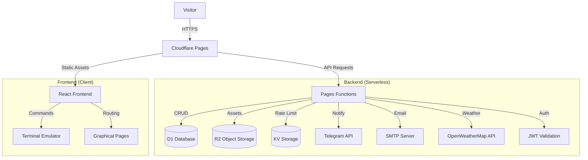
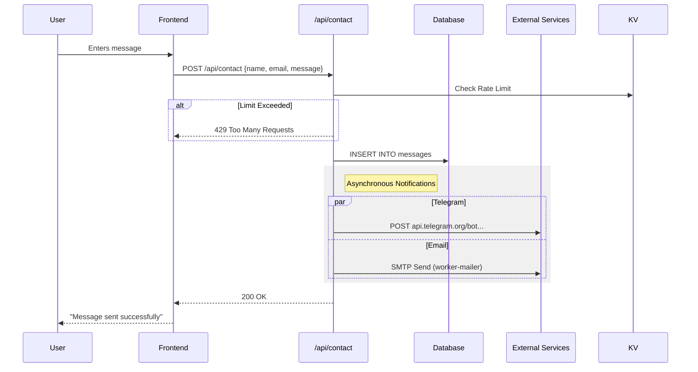
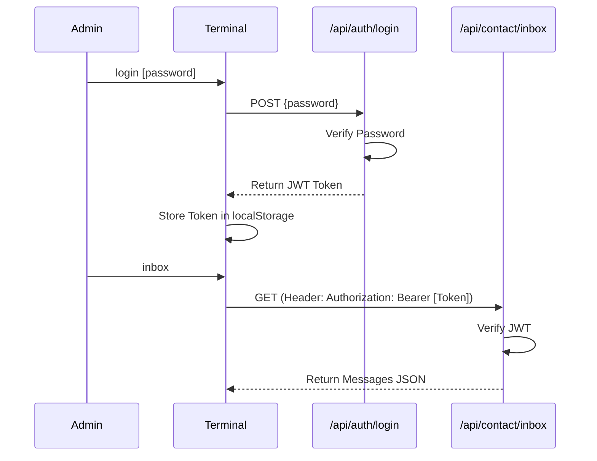

# System Architecture

## Overview

Neosphere (bweb) is a hybrid static site and serverless application built on Cloudflare Pages. It combines a React-based frontend that mimics a terminal interface with backend functionality provided by Cloudflare Pages Functions.

## High-Level Diagram

## Data Flow: Contact Form

When a user submits a message via the `/contact` page or `contact` command:

## Authentication

Authentication is used for administrative tasks (viewing messages, configuring settings).

## Database Schema

The application uses Cloudflare D1 (SQLite) for persistence.

### Tables

1. **notes**: Visitor guestbook entries (mock file system).
   - `id`, `filename`, `content`, `ip`, `timestamp`
   
2. **messages**: Contact form submissions.
   - `id`, `name`, `email`, `message`, `ip`, `timestamp`, `read`
   
3. **config**: Key-value store for site settings.
   - `key` (PK), `value`

### Object Storage (R2)

- **neosphere-assets**: Stores gallery images and other static media.
  - Accessed via `functions/api/gallery` (Listing/Serving).
  - Accessed via `functions/media` (Raw asset serving).

## Key Components

### Frontend
- **Terminal Component**: Handles command parsing, history, and "filesystem" navigation.
- **Commands System**: Modular command definitions (`ls`, `cat`, `login`, `alerts`) in `src/utils/commands.tsx`.
- **Graphical Pages**: Full-screen React components overlaying the terminal (Gallery, About, Contact).

### Backend (Functions)
- **Tech**: Cloudflare Workers (Pages Functions).
- **Location**: `/functions/api/*`.
- **Routing**: File-system based routing.
  - `functions/api/contact/index.ts`: Public contact endpoint.
  - `functions/api/contact/inbox.ts`: Protected message retrieval.
  - `functions/api/admin/config.ts`: Configuration management.

## Performance & Security

### Rate Limiting
To prevent abuse, sensitive endpoints (`/api/contact`, `/api/auth/login`) are protected by a custom rate limiter using **Cloudflare KV**.
- **Strategy**: Variable window counters (Sliding Window approximation).
- **Limits**:
  - Login: 5 attempts / 60s per IP.
  - Contact: 3 messages / hour per IP.

### Image Optimization
Gallery images stored in R2 are optimized on-the-fly using **Cloudflare Image Resizing**.
- **Frontend**: `src/utils/imageOptimizer.ts` rewrites R2 URLs to `/cdn-cgi/image/...`.
- **Backend**: Cloudflare Edge handles resizing, format conversion (WebP/AVIF), and caching.
- **UX**: Images are lazy-loaded (`loading="lazy"`) and preloaded in the lightbox for instant navigation.
