# Neosphere Project Workflow & Architecture

This document explains how the **Neosphere** project is built, deployed, and how its different parts (Cloudflare Pages, Workers, R2) fit together.

## 1. High-Level Architecture

The project is a **Static Site** (React/Vite) hosted on **Cloudflare Pages**, but it uses **Serverless Functions** (Cloudflare Workers) to handle dynamic requests like media serving and API proxying.

```mermaid
graph TD
    User[End User]
    
    subgraph "Cloudflare Ecosystem"
        CF_Pages[Cloudflare Pages<br>(Frontend Hosting)]
        CF_Functions[Pages Functions<br>(/functions directory)]
        CF_R2[R2 Storage<br>(neosphere-assets)]
    end
    
    External_API[OpenWeatherMap API]

    %% Interactions
    User -->|Visits neosphere.pages.dev| CF_Pages
    User -->|Requests /media/avatars/me.jpg| CF_Functions
    User -->|Requests /api/weather| CF_Functions
    
    CF_Functions -->|Fetches Image| CF_R2
    CF_Functions -->|Fetches Data| External_API
```

### Key Components
1.  **Cloudflare Pages (Frontend)**:
    -   Hosts the static assets built by Vite (`index.html`, JS bundles, CSS).
    -   Handles the main routing of your React app.
    
2.  **Pages Functions (Backend)**:
    -   Located in the `functions/` directory.
    -   **Magic**: These *are* Cloudflare Workers, but managed automatically by Pages. You don't need a separate worker project.
    -   **Usage**:
        -   `/media/*`: Proxies requests to your R2 bucket.
        -   `/api/*` (Future): Can handle secure API calls (like Weather) without exposing keys to the frontend.

3.  **Cloudflare R2 (Storage)**:
    -   Stores large media files (images, videos) to keep the Git repository light.
    -   **Bucket Name**: `neosphere-assets`
    -   **Access**: We don't expose the bucket directly. Instead, the Pages Function securely fetches files and serves them.

---

## 2. "Pages vs. Workers" Confusion

> **"Are we using Pages or Workers?"**

**Answer: We are using BOTH, but in a unified way called "Pages Functions".**

-   **Cloudflare Pages**: This is the "Container" for your website. It connects to your Git repo and builds your site.
-   **Cloudflare Workers**: These are the "Engine" for backend logic.
-   **Integration**: When you put a file in the `functions/` folder of a Pages project, Cloudflare automatically compiles it into a Worker and deploys it *alongside* your site.
    -   You get the power of Workers (bindings to R2, KV, D1) without the complexity of managing a separate Worker project.

---

## 3. The Deployment Workflow (CI/CD)

We use **GitHub Actions** to automate the deployment. You simply push code, and the system handles the rest.

```mermaid
sequenceDiagram
    participant Dev as You (Developer)
    participant GitHub as GitHub Repo
    participant Action as GitHub Action (CI/CD)
    participant CF as Cloudflare Pages

    Dev->>GitHub: git push origin main
    GitHub->>Action: Trigger 'deploy.yml'
    
    rect rgb(30, 30, 30)
        note right of Action: Build Process
        Action->>Action: Checkout Code
        Action->>Action: Install Dependencies (npm ci)
        Action->>Action: Build Site (npm run build) -> /dist
    end

    Action->>CF: Upload /dist & /functions
    CF-->>Action: Deployment Success (URL)
    Action-->>GitHub: Update Status (Green Checkmark)
```



### Steps in Detail:
1.  **Push**: You commit and push changes to `main`.
2.  **Trigger**: The `.github/workflows/deploy.yml` file detects the push and starts a runner (Ubuntu VM).
3.  **Build**:
    -   It installs `npm` packages.
    -   It runs `npm run build` to create the static files in `dist/`.
4.  **Deploy**:
    -   It uses `wrangler-action` to authenticate with Cloudflare (using your secrets).
    -   It uploads the `dist/` folder AND the `functions/` folder.
    -   Cloudflare spins up the new version of the site globally.

---

## 4. How R2 Integration Works

We needed a way to serve images without bloating the repo. Here is the flow:

1.  **Storage**: We created a bucket `neosphere-assets`.
2.  **Binding**: In `wrangler.toml`, we told Pages: "Hey, give my functions access to this bucket under the name `neosphere_assets`".
3.  **Proxying**:
    -   We created `functions/media/[[path]].ts`.
    -   `[[path]]` is a wildcard that catches any request like `/media/gallery/photo1.jpg`.
    -   The function takes the path `gallery/photo1.jpg`, asks R2 for that file, and streams it back to the user.
    
**Why do this?**
-   **Security**: You can add authentication later easily.
-   **Performance**: Cloudflare caches the images at the edge.
-   **Simplicity**: Your frontend just uses normal `` tags: ``.

---

## 5. Required Secrets

For this to work, your GitHub Repository needs these secrets (Settings > Secrets > Actions):

| Secret Name | Description | Source |
| :--- | :--- | :--- |
| `CLOUDFLARE_API_TOKEN` | Allows GitHub to talk to Cloudflare | Cloudflare Dashboard (User Profile > API Tokens) |
| `CLOUDFLARE_ACCOUNT_ID` | Identifies your account | Cloudflare Dashboard URL |

And your Cloudflare Pages Project needs environment variables (Settings > Environment variables):

| Variable Name | Description |
| :--- | :--- |
| `OPENWEATHER_API_KEY` | Key for weather data |
